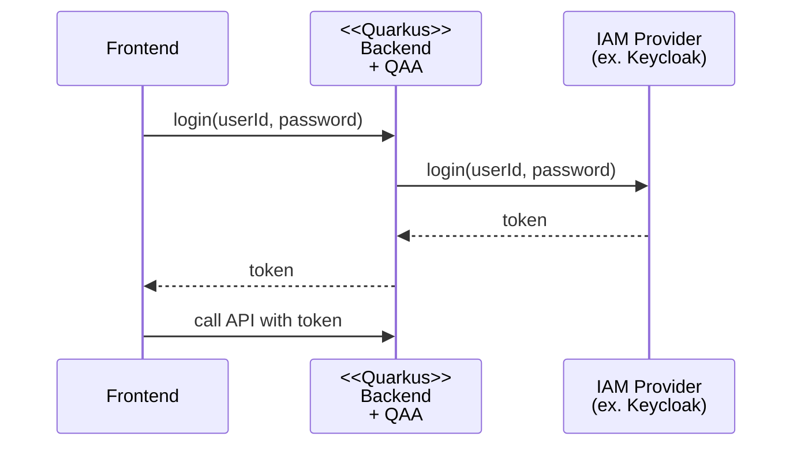

# Quarkus Auth Adapter

Quarkus Auth Adapter (QAA) is a library for implementing Bearer token authentication APIs in Quarkus.

The login flow using QAA is as follows:



## Usage

This section explains how to use QAA with Keycloak as the IAM Provider.

Required software:

- Java 21+
- Maven (or another build tool)
- Keycloak

Assume that the OIDC provider (Keycloak) has a Realm and Client already set up.

First, add the QAA dependency to your backend project's `pom.xml`:

```xml
    <dependency>
      <groupId>dev.aulait.qaa</groupId>
      <artifactId>quarkus-auth-adapter-keycloak</artifactId>
      <version>0.8-SNAPSHOT</version>
    </dependency>

    <dependency>
      <groupId>io.quarkus</groupId>
      <artifactId>quarkus-hibernate-validator</artifactId>
    </dependency>
    <dependency>
      <groupId>io.quarkus</groupId>
      <artifactId>quarkus-keycloak-admin-rest-client</artifactId>
    </dependency>
    <dependency>
      <groupId>io.quarkus</groupId>
      <artifactId>quarkus-keycloak-authorization</artifactId>
    </dependency>
    <dependency>
      <groupId>io.quarkus</groupId>
      <artifactId>quarkus-rest</artifactId>
    </dependency>
    <dependency>
      <groupId>io.quarkus</groupId>
      <artifactId>quarkus-rest-jackson</artifactId>
    </dependency>
```

Next, add the following property to Quarkus's `application.properties`:

```properties
auth.refreshToken.cookie.timeout=Refresh token expiration time (seconds)
```

Finally, add the properties to integrate Quarkus and Keycloak in `application.properties`:

- [Settings to enable Keycloak authentication/authorization in Quarkus](https://ja.quarkus.io/guides/security-keycloak-authorization#configuring-the-application)
- [Settings to use Keycloak Admin from Quarkus](https://ja.quarkus.io/guides/security-keycloak-admin-client)

After these settings, start Quarkus and Keycloak, and open [Swagger UI](http://localhost:8080/q/swagger-ui/). The following APIs will be available.

TODO: Export Swagger UI as static HTML, store it under `docs`, and set the URL for access via pages.

For a working implementation example, see the [reference implementation](./refimpl/README.md).
