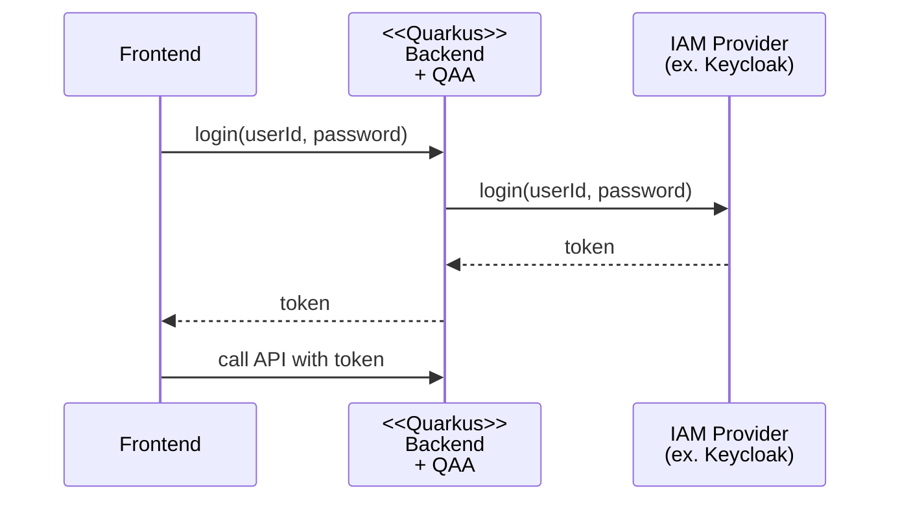
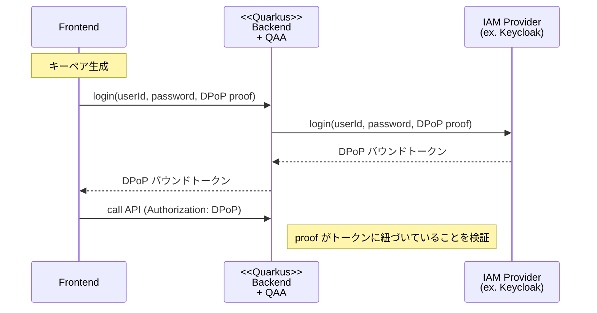

# Quarkus Auth Adapter

Quarkus Auth Adapter (QAA)は、Quarkus に Bearer トークン及び DPoP (Demonstration of Proof-of-Possession) の認証 API を実装するためのライブラリです。

QAA を使用したログイン処理フローは以下の通りです。

### Bearer Token フロー


```mermaid
sequenceDiagram
  participant Frontend
  participant Backend as <<Quarkus>><br>Backend<br>+ QAA
  participant Provider as IAM Provider<br>(ex. Keycloak)

  Frontend->>Backend: login(userId, password)
  Backend->>Provider: login(userId, password)
  Provider-->>Backend: token

  Backend-->>Frontend: token
  Frontend->>Backend: call API with token
```

### DPoP フロー


```mermaid
sequenceDiagram
  participant Frontend
  participant Backend as <<Quarkus>><br>Backend<br>+ QAA
  participant Provider as IAM Provider<br>(ex. Keycloak)

  Note over Frontend: キーペア生成
  Frontend->>Backend: login(userId, password, DPoP proof)
  Backend->>Provider: login(userId, password, DPoP proof)
  Provider-->>Backend: DPoP バウンドトークン
  Backend-->>Frontend: DPoP バウンドトークン
  Frontend->>Backend: call API (Authorization: DPoP)
  Note right of Backend: proof がトークンに紐づいていることを検証
```

## 使用方法

ここでは IAM Provider として Keycloak を使用する場合の QAA の使用方法を説明します。

必要なソフトウェアは以下の通りです。

- Java 21+
- Maven (or another build tool)
- Keycloak

Keycloak に関しては OIDC プロバイダーとして Realm、Client がセットアップ済みであるとします。

まず、Backend プロジェクトの pom.xml に QAA の dependency を追加します。

```xml
    <dependency>
      <groupId>dev.aulait.qaa</groupId>
      <artifactId>quarkus-auth-adapter-keycloak</artifactId>
      <version>0.8-SNAPSHOT</version>
    </dependency>

    <dependency>
      <groupId>io.quarkus</groupId>
      <artifactId>quarkus-hibernate-validator</artifactId>
    </dependency>
    <dependency>
      <groupId>io.quarkus</groupId>
      <artifactId>quarkus-keycloak-admin-rest-client</artifactId>
    </dependency>
    <dependency>
      <groupId>io.quarkus</groupId>
      <artifactId>quarkus-keycloak-authorization</artifactId>
    </dependency>
    <dependency>
      <groupId>io.quarkus</groupId>
      <artifactId>quarkus-rest</artifactId>
    </dependency>
    <dependency>
      <groupId>io.quarkus</groupId>
      <artifactId>quarkus-rest-jackson</artifactId>
    </dependency>

```

次に Quarkus の application.properties に以下のプロパティを追加します。

```properties
auth.refreshToken.cookie.timeout=リフレッシュトークンの有効期限(秒)
auth.token-endpoint=http://localhost:<keycloakポート>/realms/<realm>/protocol/openid-connect/token
```

最後に、application.properties に Quarkus と Keycloak を連携させるプロパティを追加します。

- [Quarkus で Keycloak の認証・認可を有効にするための設定](https://ja.quarkus.io/guides/security-keycloak-authorization#configuring-the-application)
- [Quarkus から Keycloak Admin を使用するための設定](https://ja.quarkus.io/guides/security-keycloak-admin-client)

### DPoP 設定（オプション）

DPoP を有効にする場合は、application.properties に以下のプロパティを追加します。

```properties
# DPoP 用の CORS ヘッダー
quarkus.http.cors.headers=content-type,authorization,DPoP
quarkus.http.cors.exposed-headers=DPoP-Nonce,WWW-Authenticate

# DPoP OIDC テナント
quarkus.oidc.dpop.auth-server-url=http://localhost:<keycloakポート>/realms/<realm>
quarkus.oidc.dpop.client-id=<client-id>
quarkus.oidc.dpop.credentials.secret=<client-secret>
quarkus.oidc.dpop.token.authorization-scheme=dpop

# DPoP nonce の有効期限
qaa.dpop.nonce-ttl-seconds=DPoP nonceの有効期限(秒)
```

また、DPoP リクエストを `dpop` テナントにルーティングするための `io.quarkus.oidc.TenantResolver` の実装と、サーバー nonce を管理する `DPoPNonceProvider` の実装が必要です。

以上の設定後、Quarkus、Keycloak を起動し[Swagger UI](http://localhost:8080/q/swagger-ui/) を開くと以下の API が使用可能な状態となります。

TODO: Swagger UI を static html としてエクスポートし docs 以下に格納、pages 経由でアクセスする URL を設定

以上の設定の動作可能な実装例は[リファレンス実装](./refimpl/README.md)を参照してください。
